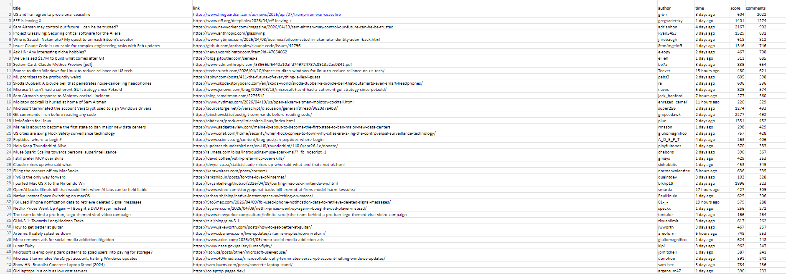

# Hacker News Scraper & Analyzer

A Python-based tool that collects, analyzes, and exports data from Hacker News.
The project demonstrates real-world web scraping, data processing, and report generation using clean and structured code.

---

## Overview

This project automatically scrapes multiple pages from Hacker News and extracts key information about posts.
The collected data is processed, sorted, and exported into a well-formatted Excel file for further analysis.

> **Goal:** Simulate a real-world data pipeline:
> `data collection` → `data processing` → `data analysis` → `data export`

---

## Features

| Feature | Description |
|--------|-------------|
| Multi-page scraping | Collects data across multiple Hacker News pages |
| Error handling | Skips failed pages without crashing the script |
| Missing data support | Safely handles posts with no score, author, or comments |
| Numeric conversion | Converts text-based scores and comments into integers |
| Sorting & analysis | Ranks posts by number of comments |
| Excel export | Saves results to a formatted `.xlsx` file |
| Auto column width | Adjusts column sizes for readability |
| Styled headers | Bold headers for better visual structure |

---

## Technologies Used

- **Python** — core language
- **requests** — HTTP requests
- **BeautifulSoup** — HTML parsing
- **openpyxl** — Excel file generation

---

## Installation

    pip install requests beautifulsoup4 openpyxl

---

## Usage

    python hacker_news.py

Output file will be saved in the project directory:

    hacker_news.xlsx

---

## How It Works

1. Script sends HTTP requests to Hacker News pages with a timeout
2. Failed or unavailable pages are skipped automatically
3. HTML content is parsed using BeautifulSoup
4. Each post is extracted along with its metadata
5. Data is cleaned and converted into usable formats
6. Results are stored in a structured list
7. Data is sorted by engagement (comments)
8. Output is saved into a formatted Excel file

---

## Output Example

The generated Excel file contains the following columns:

| Column | Description |
|--------|-------------|
| Title | Post title |
| Link | URL to the article |
| Author | Username of the poster |
| Time | Time since posted |
| Score | Number of upvotes |
| Comments | Number of comments |

Posts are sorted by number of comments in descending order.

---

## Notes

- A 1-second delay between requests is used to avoid overloading the server
- Requests use a 10-second timeout to prevent hanging on slow responses
- Pages that return a non-200 status code are skipped automatically
- Network errors are caught and logged without stopping the entire scrape
- Missing or incomplete post data is handled gracefully

---

## Use Cases

- Market and trend analysis
- Monitoring popular discussions in tech
- Data collection for further analytics
- Portfolio demonstration of scraping skills

---

## Future Improvements

- Add data visualization (charts)
- Build a web interface (Streamlit or Flask)
- Implement async scraping for performance
- Add filtering and keyword search
- Store data in a database

---

## Preview

---

## Author

Developed as a practical project to demonstrate web scraping, data processing, and report generation skills.
